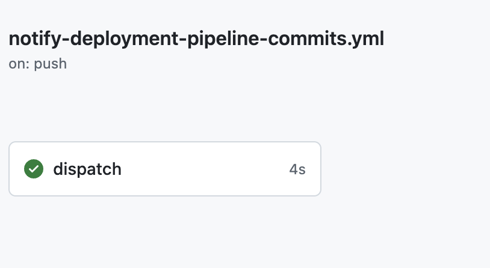
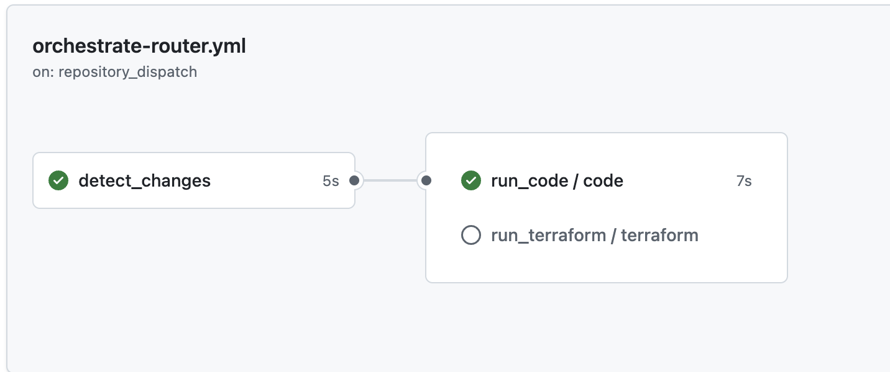
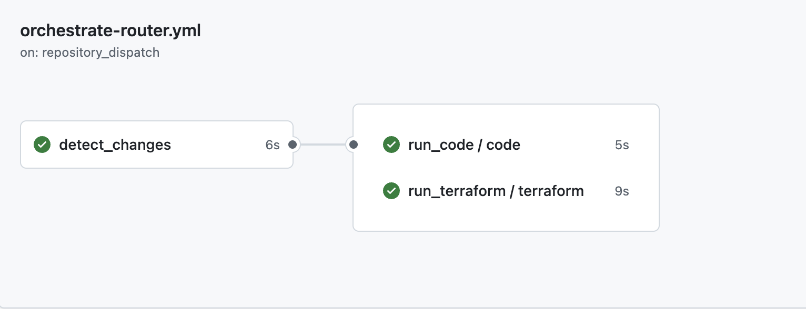
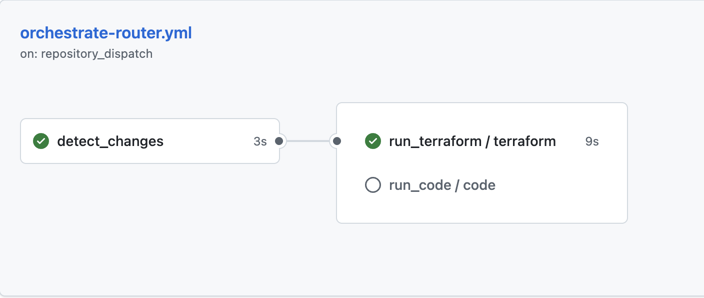

# Cross Repo CICD Orchestration

## **Definition:**

- It is a way to design pipelines that separate infrastructure and deployment code into different repositories for more modularity and maintainability 
- These separate repositories communicate and trigger one another 

## **Structure:**

- **Developer Repository:** This is the source of truth that contains all the application code. This has a workflow that triggers a build in the deployment repository 
- **Deployment Repository:** Contains the CI/CD pipeline, terraform code and deployment logic. Basically, anything infra related. This is the centralized place for any compliance/terraform apply rules. 

## **Workflow - An Overview:**

### 1. Event-Driven Approach

- Repository A (developer) on push/pr detects any changes that has happened to the code. 
- Then it sends a repository_dispatch token to Repository B (deployment) with SHA, branch, and messages that indicate which part of the code has changed. 
- Repository B (deployment) listens for repository_dispatch and runs the appropriate workflows 
### 2. Polling Approach

- Repository B (deployment) regularly polls Repository A (development) for any changes and accordingly triggers the pipeline when changes are detected
- This method is less efficient in comparison to the event-driven approach. 

## **Advantages:**

- Greater separation of concerns
- Security isolation: secrets live in the pipeline repo and not the code repo 
- Governance and compliance
- Standardization: all services will deploy the same with the same terraform rules
- Scalability: one deployment repo can be attached to hundreds of separate developer repos

## **Proof of Concept: Using GitHub Actions**

### Step 1: Create a token in Repo A(developer) to call Repo B(deployment) 

- Authentication is required to trigger workflows in another repository 
- This can be done using a github app token, or a personal access token (PAT)
	- Click on your profile and navigate to `Settings`
	- Find `Developer Settings` on the left sidebar
	- Create a new Personal Access Token (classic) and select the scope to be `repo` and `workflow`. Make sure to copy the token as it would be displayed only on the time of creation. 
- This token would need to be stored as a secret in Repo A to call Repo B.
	- Navigate to `Settings` under your Repo A 
	- Click on `Secrets and Variables` on the left sidebar 
	- Create a new repository secret. Paste the github pat token as the value. 

### Step 2: Create a 'notify' workflow in Repo A

- This workflow is used to notify Repo B in case there are any changes made to the codebase on push/pr 
- Create a new workflow under .github/workflows.
- Ensure that under client payload information about the github ref and sha are sent. 
- This does not run the real deploy, it just sends a message to Repo B. 
  
**One way to notify which part of the codebase has been changed would be the use of boolean flags. This is not imperative, but it is the easiest approach.**

```
client-payload: |
{
	"terraform_changed": "${{ needs.changes.outputs.terraform }}",
	"code_changed": "${{ needs.changes.outputs.code }}"
}
```

**Another method would be for Repository A to also send the previous commit to Repository B, in that way the pipeline would be able to compare the two to infer what has changed in the new commit. Point to note: this will not work for PRs.**

- Repository A:
  
```
  client-payload: |
  {
    "source_repo": "${{ github.repository }}",
    "ref": "${{ github.ref }}",
    "sha": "${{ github.sha }}",
    "before": "${{ github.event.before }}"
  }
```

- Repository B:
  
```
  git diff --name-only "${{ github.event.client_payload.before }}" "${{ github.event.client_payload.sha }}"

```
### Step 3:  Configure Project Folder and Repository B

- Create an empty repository, example `deployment-repository` 
-  Initialize this repository in your local machine in the project folder where you want to execute this pipeline in.
```
    git init
    git remote add origin https://github.com/username/reponame.git\
```

-   Create a new branch 'main' and switch to it  ```
  ```
  git branch -M main/ git checkout -b main
  ```
  
-  Create a folder .github/workflows in your project folder. This is where your github pipelines will exist. 
- **Additional note:** make sure under `Settings -> Actions -> General`, There is action permission and reusable workflows allowed. 
### Step 4: Create Orchestration Workflow in Repository B

- This workflow would be the one that listens to any messages from Repository A and will trigger the pipeline based on any changes.
- Create a workflow under .github/workflows called orchestration.yml
- Make sure it triggers every time there is a change in Repo A. 
- This can be the sole workflow in repository B that will automatically execute whichever portion of the source code has been changed by separating it as different jobs with different 'if conditions'. (refer to full_pipeline.yml -> uses boolean approach)
- Another method would be to have different pipelines for to handle different parts of the source code (shared library approach). In this way, orchestration.yml would be the true router that would trigger other pipelines based on where the code changes have been made (done by using `workflow_call`) (refer to orchestration.yml, resuable_code.yml, reusable_terraform.yml -> uses git diff approach )

## **Outputs:**

### Case 1: Changes to code, not terraform 

- Repo A triggers Repo B:
  
  
- Repo B runs orchestrator pipeline -> identifies and runs reusable_code.yml ONLY:
  
!


### Case 2: Changes to terraform and code:

- Both reusable_code.yml and reusable_terraform.yml were executed:
  
  
### Case 3: Changes to terraform, not code:

- Only reusable_terraform.yml was executed:
  


**Additional note:** pipeline history under `reusable_terraform.yml` and `reusable_code.yml` will NOT show up since they are pipelines that only execute when called by another pipeline (`workflow_call`). To make them run manually, add `workflow_dispatch` as an additional trigger.